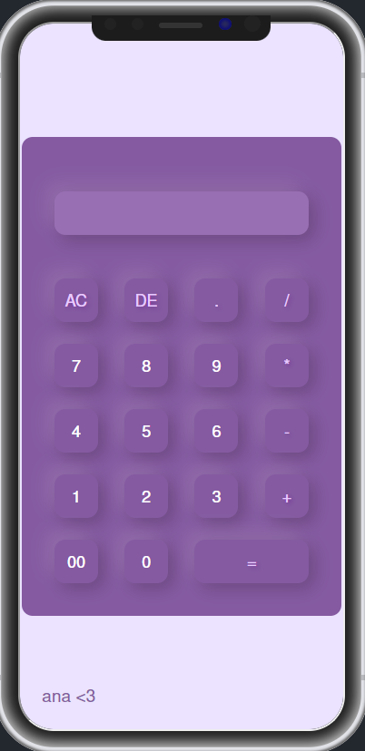

# **Calculator 🧮**

This is a simple web page that features a calculator built using HTML, CSS, and JavaScript. The calculator allows users to perform basic arithmetic operations such as addition, subtraction, multiplication, and division.
You can use it by clicking this link! 
[Calculator](https://anndr0.github.io/calculator/)

## **Features 🧶**

- Basic arithmetic operations: Addition, subtraction, multiplication, and division.
- Responsive design: The page is designed to be responsive and adapt to different screen sizes, making it suitable for use on various devices including desktops, tablets, and smartphones.
- Keyboard support: Users can also input numbers and operations using their keyboard, including support for the enter key to calculate results.

## **Responsive**

For smartphones!

<p align="center">
  
</p>

For desktops!

<p align="center">
  
</p>

## **Usage 📝**

To use the calculator, simply click on the buttons corresponding to the numbers and operations you want to perform. The input will be displayed in the calculator's display area, and you can click on the "=" button or press the enter key to calculate the result.

## **Technologies Used 🛠️**

- HTML
- CSS
- JavaScript

## **Installation ⚙️**

To run the calculator page locally, simply clone this repository to your local machine and open the **`index.html`** file in your web browser.

```bash

git clone https://github.com/anndr0/calculator.git

```
## **Author ✍️**

Ana Duran ♡
